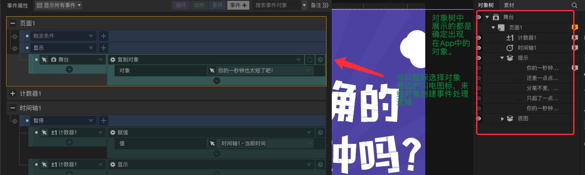
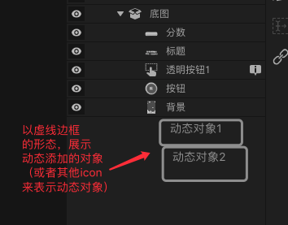

# 可视化编辑器如何设计、实现,如何保存和加载配置


## 一、处理类型的序列化和反序列化

你没看错，编辑器实现过程中，首当其冲的问题就是如何保存、加载配置。

这里面核心的问题，主要有下面几个：

### **1.JSON的问题**

为了简化和方便使用，我们采用`JSON`来进行整个app配置信息的序列化和反序列化。但是实际开发过程中，遇到了一些问题:

 > JSON主要用于`数据`的序列化，是不含类型信息的

 假如序列化的结果中不包含类型信息，那么是不是我们就无法反序列化了呢？
 
 仔细想想，对比java等其他强类型语言的JSON序列化库的实现(如`java的fastJSON`)，答案`很显然不是`，因为我们可以在反序列化的时候，指定初始类型信息，然后再根据类型本身定义的信息去进一步序列化。

 伪代码如下:

 ```javascript

    let jsonString = '{a:{b:123}';

    class B{
        b;
        doSomething(){
            //do some business logic
        }
    }

    class A{
        //need to declare class info here(ts or decorator)
        a;
        doSomething(){
            //do some business logic
        }
    }

    function deserialize(str,targetClass){
        //use targetClass to handle deserialize of str
    }

    // pass Class info to help deserialize,it should work?
    let a1 = deserialize(jsonString,A);


 ```

 `但是`，这里存在一个严重的问题，我们计划使用`TypeScript`或者ES的Decorator来给`类型的属性`标识类型信息，但是，这在当前是做不到的


### **2.ECMAScript 以及 TS 的属性元数据缺失**

截止`2018年11月28日`，通过调研，发现无论是`TypeScript`还是`ECMAScript`,其实现过程中，都无法在`运行时携带类型的属性信息`，能够携带的只有:

- Class本身的信息
- Class内部方法的信息(不包含方法的参数类型信息)

为了解决这个问题，`ui-designer`开发了自己的类型系统：


> 待补充...

### **3.数组元素序列化的问题**

假如我们有2个类A,B,B继承A:

(伪代码)

``` javascript

 class A{}

 class B extends A{
     do(){
         //do something of B
     }

 }

```

下面我们有一个C类，里面有一个数组成员:

```javascript

 class C{
     field : Array<A>
 }

 var c1 = new C();
 c1.field=[];
 c1.field.push(new A())
 c1.field.push(new B())
```

`问题来了`，我们要如何才能把c1给序列化，并且:`使得反序列化之后能够得到正确的field`呢？

在普通的应用开发中，我们使用JSON来进行序列化和反序列化不存在任何问题，因为我们需要的是里面的数据信息，但是，如果`ui-designer`无法知道反序列化之后的对象是什么类型，那么如何正确的处理控件的行为？

### **4.冗余的默认属性**

考虑这样一个情况，假设我们配置了一个应用，里面使用了大概50个组件。

然后我们修改了其中10个组件的部分属性，现在我们要把这个应用配置保存下来。并且在运行的时候丢给引擎去加载。

假设

- 一个组件有10个属性
- 我们修改了每个组件的3个属性

那么，可想而知，如果这些属性我们都序列化，那么会多出`70%`以上的配置元数据。

> 这些元数据真的是我们需要的吗？能不能省略？

我们认识到，`字段的默认值`在`ui-designer`中，应该被视为`类型信息的一部分`，只有这样，他们才不需要被当做数据来进行序列化，只需要在设计器的运行时、引擎的运行时里，作为类型信息存在即可。


## 二、如何让编辑器可以方便的设置“动态创建的对象”的属性

在`容器类`控件中，我希望可以做到允许动态的配置`创建子对象`的行为，举个例子，要实现下面的功能:

> 用户每点击A区域一次，就在A区域里增加一个文本框，上面写着当次点击的序号:1,2,3...

要实现这个功能，貌似很简单，我们只需要给`container`类型的组件，添加一个`行为(Action)`叫做:`addChild`即可.

但是考虑下面的需求进阶:

> 进阶需求：要求动态创建出来的文本框如1,2,3，也可以被点击，点击的时候气泡显示自己的序号

如何处理？在传统的编辑器环境中，一般都是只展示当前`确定在App中出现的对象`，如下概念图:



为了解决这个问题，设计器可以对`addChild`行为的参数:`child`做特殊处理：

- 当检测到某个组件的eventHandler中配置了AddChild的action，则获取其动态添加的对象参数，以虚线框标识的`动态组件`形态，显示在添加它的父亲下
- 这种动态组件应该和普通对象组件一样，可以设置属性，设置事件绑定

下面是设计的概念图:

