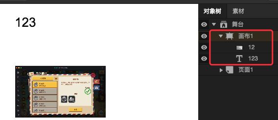

# 画布容器

画布容器是对Canvas的一个抽象，方便制作和绘图相关的应用。

## 思路收集

### **直接拖图片\文本到画布下面**

`ui-designer`中，画布在对象树中属于容器，里面可以添加其他东西，图片、文本等

### **画布打印**

`ui-designer`中，画布具有`打印`方法，可以把内部的内容输出为一个图片，可以指定格式，和目标位置

## 概念

待完善