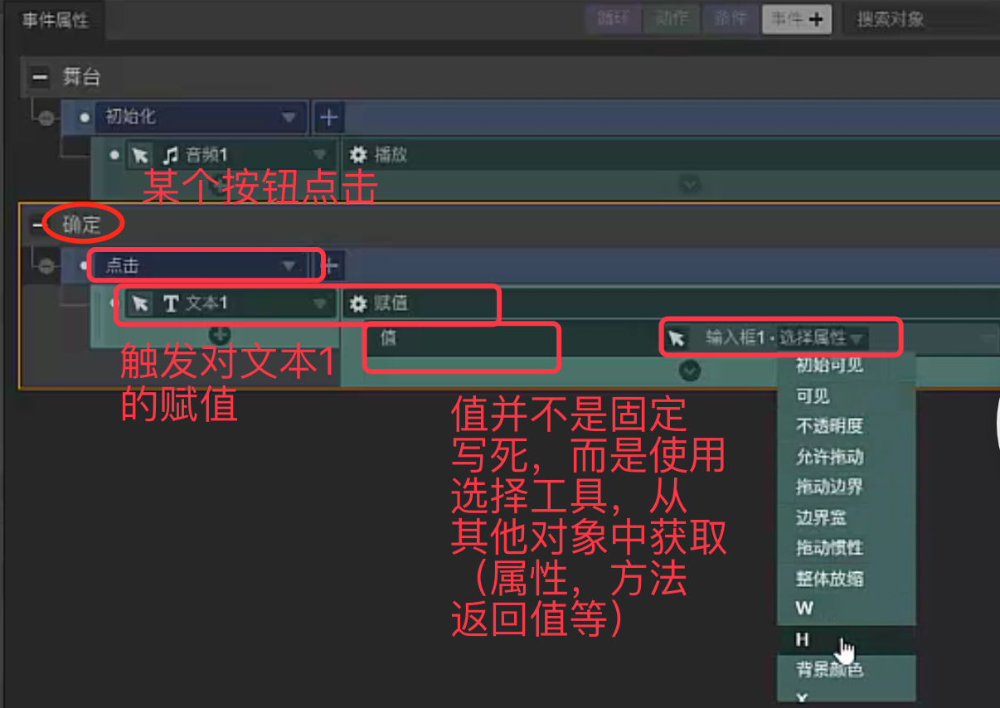

# 求值器

`求值器` 是一个设计编辑面板的时候需要考虑的东西，它主要用来在给对象添加`事件处理逻辑`或者给一些函数传递`参数`
的时候，用来`获取参数`的组件设计。

这个概念，我是在设计 `ui-designer` 时总结出来的，其灵感来源于iH5,如下图(来自iH5):

## 思路梳理

### **利用强类型系统，来做属性、方法选择的自动过滤**

通过截图我们看到，当需要给一个对象的某个属性赋值的时候，我们应该可以知道`目标属性的类型`。那么在求值器准备
去其他对象那里获取一个属性/方法返回值的时候，利用类似`Typescript`或者`flow.js`这样的强类型系统，我们实际
上可以做一些选择的优化，屏蔽掉一些类型不符的选项

> 当然，这样做有一些风险，比如一些数字和字符串可以互相转化的情况，实际开发的时候可以考虑用颜色进行区分，总之
尽量提高用户选择的便捷性

