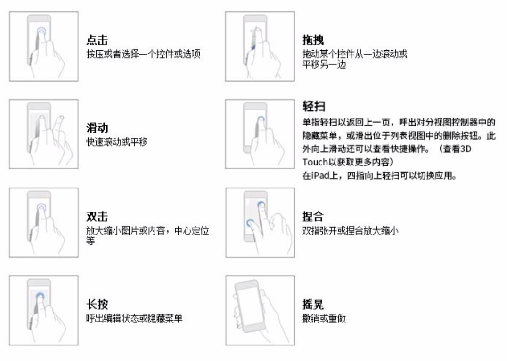

# 交互手势

现代的人机交互系统，最常用的、最便捷高校的交互方式可能就是`手势系统`, ui-designer 中,对于手势系统有自己的一套体系设计。

> 在具体软件平台的实现引擎中，对于手势的实现方式可能不尽相同，但是整体必须遵循本文所描述的规范

## 手势类型

### tap

### swipe

### rotate

### press

### pinch

## 3D 手势

`ui-designer`也会考虑对3D手势的支持，比如

- 轻按(Peek)
- 重压(Pop)

## 现有平台手势设计参考

### iOS 9

### Material Design

英文名称|中文名称|解释
-------|------|-----
touch|单次触击|一只手指按下，提起
double-touch|双次触击|手指连续按下2次，提起
swipe|轻滑/拖动/投掷|一只手指按下，移动再提起
long-press|长按|一只手指按下，稍后再提起
long-press-drag|长按拖动|一只手指按下后稍后，移动，再提起
double-touch-drag|双触拖动|一只手指按下后提起，再按下后，拖动，再提起
pinch-open|捏放|双指按下，向外移动，再提起
pinch-close|捏合|双指按下，向内移动，再提起
two-finger-touch|双指触击|双指快速按下，提起
two-finger-swipe|双指拖拽，轻滑和快掷|两指按下，移动后提起
two-finger-long-press|双指长按|双指按下，稍后提起
two-finger-long-press-drag|双指长按拖动|双指按下，稍后移动，再提起
two-finger-double-touch|双指双次触击|双指快速按下提起，重复一次该动作
rotate|旋转|双指按下，以指间中点为圆心快速转动，再提起

