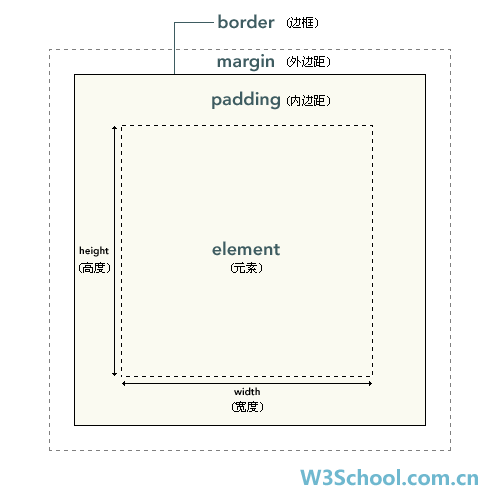

# 布局设计

ui-designer 中，元素的布局是一个非常关键的方面。如何设计就非常关键了

## 思路收集

> 因为目前web的布局体系应用范围较广，所以在布局策略上，考虑借鉴web的布局技术来定义

### **盒子模型**

`ui-designer`采用标准的W3C盒子模型：

## 概念

### **自动排版容器**

自动排版容器，主要用于制作所谓的`响应式`或者`自适应`的布局效果。其布局逻辑参考Web的flex布局

### **绝对布局容器**

绝对布局容器下的元素，其特点是可以自由的根据父元素的相对位移来布局自身。正常排版过程主要也是靠用户拖动元素得到偏移量(x,y),然后相对父元素来做定位
