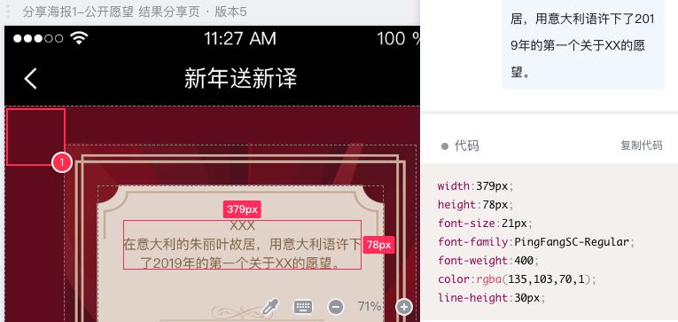

# 路线图

`ui-designer` 纯碎是一个业余项目，主要是为了验证自己的想法能否成功实现。路线图方面，大体规划如下

## V0.1 基础设施搭建

在这个版本阶段，主要解决一些基础设施问题，包括但不限于：

- 研究学习，并思考如何抽象不同平台上所定义的一系列交互概念？
- 整体架构设计

**TODO**

No content

**DONE**

- 完成Action类型设计[ok]
- 完成EventHandler类型设计 [ok]
    - 定义operator,expression等类型。完善其内部实现
- 完成runtime里的序列化、反序列化方法实现
    - 序列化 [ok]
    - 反序列化 [ok]
        - 解决Object,UIObject,以及对应EventHandler信息的序列化、反序列化问题
        - 2
- 测试用例
    - 枚举类型系统测试
    - 类型系统，序列化、反序列化测试
    - expression,operator系统测试

## V0.2 交互模式核心层搭建

在这个阶段，需要构建出整体的、经过抽象后的中间交互核心层的类型体系。

抛开各平台的引擎实现，这一层交互层概念模型是绝对的核心，它既要非常精简，又必须非常灵活，可以实现95%甚至100%的当前已知其他平台希望实现的功能。

在这个阶段，还需要完成`所见即所得编辑器开发和完善`

- 如何实现强类型对象的序列化，以及减少重复的默认属性序列化带来的额外开销。
- 序列化之后的字符串，需要考虑在下一阶段的引擎层面，如何能够正确的反序列化，从而构建起整个应用

### 详细计划

- 编辑器的对象树开发
  - [`已完成`]完成对象树组件开发，可以读取json格式的对象元数据，并且树形结构呈现在组件内部
  - 对象树和可视化区域的协调
- 左侧工具箱开发
  - [`已完成`]列表展示所有可用的工具
  - [`已完成`]根据当前用户选择的对象，列出可以使用的工具(`可点击`)
  - [`已完成`]选择工具之后，修改state里的当前选择状态，和选择模式
  - [`已完成`]完成矩形工具开发
  - 完成图片工具开发
  - 完成圆形工具开发
  - 完成文本工具开发
- 通用属性面板开发
  - [`已完成`]属性面板的布局
  - [`进行中`]面板中不同数据类型的处理逻辑和UI控件
    - [`已完成`]文本组件功能
    - [`进行中`]数字输入框功能
      - [`已完成`]数字输入框样式定制
      - [`进行中`]数字输入框支持单位和控制框轮流展示
    - [`已完成`]slider组件功能
    - [`进行中`]组件绑定值同步功能
- 特殊属性面板开发
  - 时间轴面板
- 中间可视化布局区域开发
  - 背景网格图
  - 根据当前选中模式，支持拖拽产生对象，并加入当前对象树

## V0.3 移动端HTML5引擎设计和开发

创建`ui-designer`这个项目，最开始是为了解决移动H5开发的问题。在交互模型核心定型之后，进行移动端引擎开发是最合适不过了。

这个阶段需要明确引擎开发、用户自定义组件开发的范式。主要需要考虑一个问题：
> 一个交互组件，在编辑器端，和在实际运行环境中，都要能有一致性的表现，如何解决重复开发量的问题。(即无论开发什么平台的引擎组件，都需要一个web编辑器端的渲染器，否则无法可视化编辑)

>实现引擎需要考虑，如何通过可视化编辑平台提供的序列化后的配置信息，在引擎层面反序列化加载完整的应用 

## V0.3.1 元素的属性面板，支持直接输入`sketch`或者`蓝湖`的属性字符串

很多在线工具可以浏览UI设计产物的属性，比如：

考虑支持在属性面板中允许用户粘贴这些字符串，然后自动解析为可识别的属性。

## V0.3.2 支持导入PS的项目文件，自动创建页面结构

- 调研PS软件的数据文件格式
- 开发相应功能，使得编辑器可以导入并且分析PS数据文件，创建对应的页面结构，并自动设置相关元素的属性

## V0.3.3 支持导入手绘的图纸，自动创建页面结构

调研是否可以支持用户导入手绘原型，直接在编辑器里给用户生成一个页面。用户只需要在生成好的页面上做一些调整即可。

使用的图片->html的技术，可参考:
- [这篇文章](https://blog.insightdatascience.com/automated-front-end-development-using-deep-learning-3169dd086e82)
- [sketch-code项目](https://github.com/ashnkumar/sketch-code)

## V0.4 小程序端引擎设计和开发

完成小程序端的引擎开发

## V0.5 android端引擎设计和开发

## V0.6 iOS端引擎设计和开发

## V0.7 内置领域对象、交互模型完善和迭代

完善一些功能，比如：
- 状态对象
    - 可以定义app的状态
    - 可以把状态的key与其他对象的某些Attribute进行关联，实现状态改变驱动界面元素变化的功能
